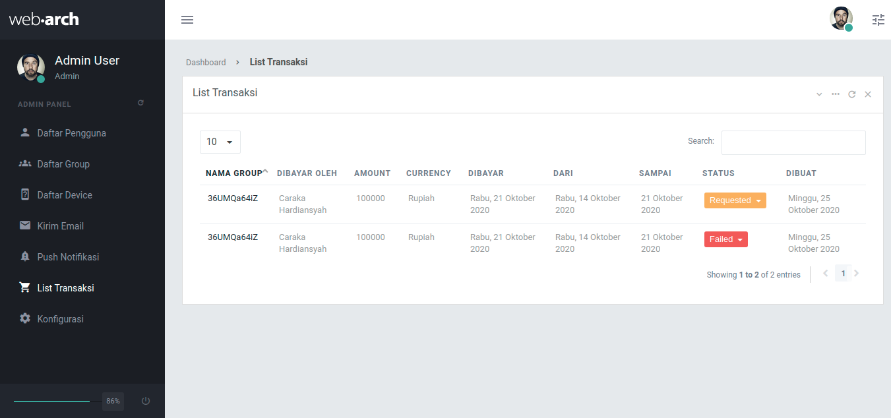

# Table of Contents

- [Installation & Configuration](#installation)
- [Auth API](#auth-api)
- [Error Code](#error-code)
- [User API](#user-api)
- [Group API](#group-api)
- [Dashboard API](#dashboard-api)
- [Device API](#device-api)
- [Admin Panel](#admin-panel)
- [Configuration API](#configuration-api)

## Installation
```
composer install
```

copy .env.example to .env, edit
```
APP_NAME='Nama Aplikasi'

// Config Database
DB_DATABASE='nama database'
DB_USERNAME='username database'
DB_PASSWORD='password database'

// Config MAil
MAIL_MAILER=smtp
MAIL_HOST='your mail host'
MAIL_PORT=2525
MAIL_USERNAME='username mail'
MAIL_PASSWORD='password mail'
MAIL_ENCRYPTION=null
MAIL_FROM_ADDRESS='akun@mail.lan'

// Config APN
APN_KEY_ID='your apn id'
APN_TEAM_ID='your apn team id'
APN_BUNDLE_ID='your apn bundle id'
APN_PRIVATE_KEY='your apn private key'
```

migrate database

```
php artisan migrate --seed

OR

// Jangan dilakukan ketika di server
// Karena akan mereset database
php artisan migrate:fresh --seed
// data dumy
php artisan db:seed --class=DummySeeder
```

Config Queue
```
Menggunakan cron

*/1 * * * * {path}/php {path project}/artisan queue:work --stop-when-empty
```

Run development server
```
php artisan serve
```

## Auth API
```
Accept => application/json
Authorization => Bearer apitoken
```

## Error Code
```
0 => Sukses,
1 => Field Harus diisi,
2 => Authenticate diperlukan,
3 => Data tidak ditemukan,
4 => Data sudah ada,
5 => Kicked/Rested dari group,
6 => Kadaluarsa
```

## User API

```
POST localhost:8000/api/user
GET localhost:8000/api/user (auth)
POST localhost:8000/api/user/profile (auth)
```

## Group API

```
Show
GET localhost:8000/api/group/{id} (auth)

Logout
GET localhost:8000/api/group/{id}/logout (auth)

Join Group
POST localhost:8000/api/group/{id}/join (auth)

Request Reading
POST localhost:8000/api/group/{id}/reading/request (auth)

Finish Reading
POST localhost:8000/api/group/{id}/reading/request/{requestId} (auth)
```

Create Group Private

```
Create
POST localhost:8000/api/group
field = [
  'name' => 'required',
  'grouptype_id' => 'required',
  'city' => 'required',
  'province' => 'required',
]

Get Group Type
GET localhost:8000/api/grouptype
```

Users Group

```
GET localhost:8000/api/group/{id}/users
```

Paid Group

```
POST localhost:8000/api/group/{id}/paid
field = [
'amount' => 'required',
'currency' => 'required',
'valid_form' => 'required|date',
'valid_until' => 'required|date',
]
```

## Dashboard API

```
POST localhost:8000/api/dashboard (auth)
field = [
'os' => 'required',
'locality' => 'required',
'administrativeArea' => 'required',
]
```

## Device API
```
POST localhost:8000/api/device (auth)
field = [
  'os' => 'required',
  'token' => 'required'
]
```

## Configuration API
```
GET localhost:8000/api/configuration/{key}
```

## Admin Panel

Login
```
Login
localhost:8000/
```

Daftar User

```
Klik pada nama user untuk detail
```


Daftar User

```
- History bacaan
- Daftar devicenya (karena 1 user bisa banyak device)
- Kirim Push notification per device & untuk semua device yg dipunya si user
- User bisa saya disable, jadi ga bisa login lagi dia.
- Total ayat dibaca hari ini, bulan ini, dan all time
```


Daftar Group

```
Klik pada nama group untuk detail
```


Detail Group

```
- Data grup seperti Tipe, Kota, provinsi, anggota, validity, dibuat tanggal harusnya tetap keliatan di halaman detail
- Daftar usernya dan siapa adminnya. Sebagai admin, saya juga bisa ngeset siapa adminnya, dan mengeluarkan user dari grup
- Total ayat dibaca hari ini, bulan ini, dan all time
```


Transaksi

```
- List transaksi
- Detail transaksi, saya bisa ngeset status bayarnya jadi Paid kalau belum
```



Push Notifikasi

```
- Kirim push ke semua device
- Kirim push ke device yang terdaftar di grup tertentu saja
- Kirim push ke device berdasarkan model devicenya, app_version, timezone, os_version, os, dan token tertentu saja.
```


